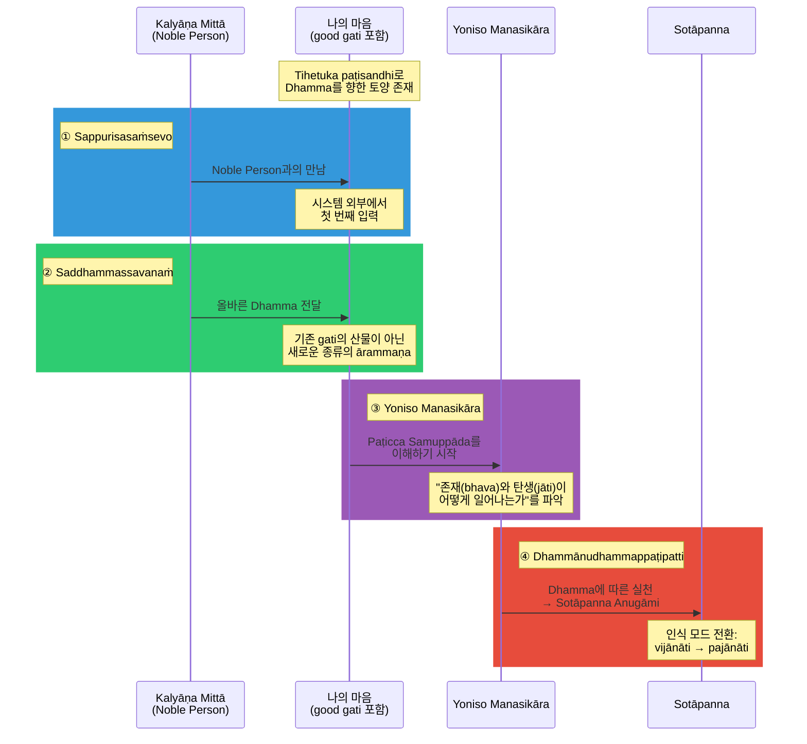
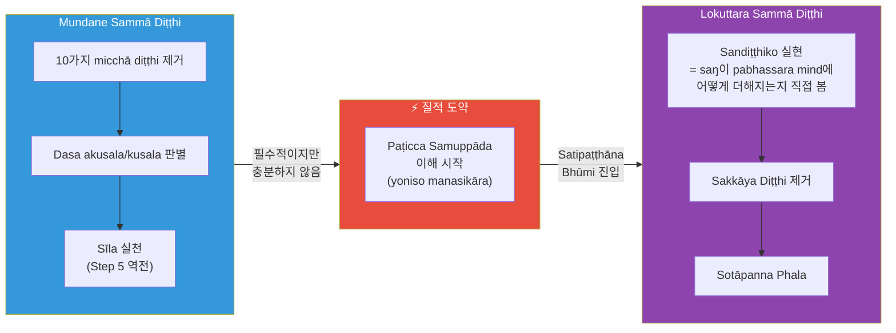
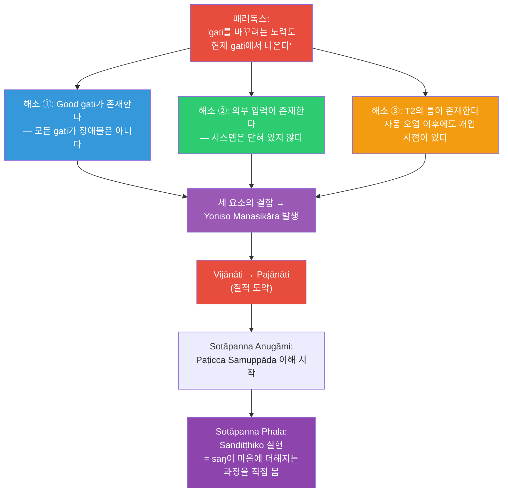

## 질문

Citta가 발생하는 순간 gati에 따라 자동으로 오염된 상태로 시작하고, 9단계 오염이 10억분의 1초 안에 완료된다. 그렇다면 gati를 바꾸려는 의도 자체도 현재 gati가 만들어낸 citta 안에서 일어나는 것이다.

이 순환에서 빠져나올 수 있는 지렛대(leverage point)는 어디인가?

Cūḷavedalla Sutta(MN 44)에서 lokuttara Sammā Diṭṭhi의 두 조건으로 제시하는 "parato ca ghoso"(Noble Person으로부터 듣기)와 "yoniso manasikāra"(Paṭicca Samuppāda의 이해)가 바로 그 지렛대인가? 그리고 이 과정에서 good gati(tihetuka paṭisandhi 등)는 어떤 역할을 하는가?

---

## 답변

### 1. 패러독스의 범위를 정확히 한정하기

이 질문이 날카로운 것은 맞지만, 과장되지 않도록 범위를 먼저 한정해야 한다.

Pure Dhamma에서 밝히는 사실: citta는 pabhassara citta로 시작해서 점차 오염되는 것이 **아니라**, 처음부터 gati에 따라 distorted saññā를 안고 태어난다. 9단계 오염(citta → mano → mānasan → hadayaṁ → ... → viññāṇakkhandha)은 의지력으로 통제할 수 없다.

**그러나** 이 사실이 곧 "완전한 막다른 골목"을 의미하지는 않는다. 왜냐하면:

**(a)** Gati에는 **good gati와 bad gati가 모두 포함**된다. 과거 생의 puñña kamma로 tihetuka paṭisandhi(alobha, adosa, amoha의 세 좋은 hetu를 가진 태어남)를 얻은 사람은, 이미 Dhamma를 향하는 경향성을 내재하고 있다. 이것은 오염이 아니라 **토양**이다.

**(b)** Arahant가 존재한다는 사실 자체가, 순환이 깨질 수 있다는 증거이다. 만약 gati 순환이 진정 빠져나올 수 없는 것이라면, 31 계에서 Nibbāna로의 탈출은 논리적으로 불가능하다.

따라서 패러독스의 정확한 범위는 이것이다: **T1 시간 스케일(10억분의 1초)에서의 자동 오염은 통제 불가능하다. 그러나 그것이 곧 gati 변화의 불가능을 뜻하지는 않는다.** 핵심은 어디서, 어떻게 개입이 가능한가이다.

### 2. 세 개의 시간 스케일

**T1**: 여기서는 개입이 불가능하다. Mano saṅkhāra는 gati에 따라 자동 생성된다.

**T2**: Mano saṅkhāra가 vacī saṅkhāra로 전이될 때, "알면서 계속 붙잡고 있는" upādāna 단계가 시작된다. 이 단계에는 **시간이 있다.** 여기서 sati가 작동할 수 있다.

**T3**: T2에서의 반복적 개입이 축적되면 gati 자체가 변한다.

그러나 핵심 질문은 여전히 남는다: **T2에서 작동하는 sati와 Dhamma 지식은 어디에서 오는가?**

### 3. 외부 입력: 시스템이 스스로 풀 수 없는 것

SN 55.55(Sotāpattiphala Sutta)와 SN 55.5(Dutiyasāriputta Sutta)에서 Buddha는 Sotāpanna 단계의 네 가지 조건을 제시한다:

> *"Sappurisasaṁsevo, saddhammassavanaṁ, yonisomanasikāro, dhammānudhammappaṭipatti."*

**순서가 결정적이다:**

**처음 두 조건은 시스템 외부에서 온다.** 이것이 패러독스의 해결 열쇠이다.

MN 44(Cūḷavedalla Sutta)에서 dhammadinnā는 더 명확하게 말한다:

> *"lokuttara Sammā Diṭṭhi의 두 가지 조건은 'parato ca ghoso'(Noble Person의 가르침)와 'yoniso manasikāra'이다."*

오염된 물이 스스로를 정수할 수 없다. 그러나 **외부에서 정수제(Saddhamma)가 투입되면**, 물은 그 정수제와 반응할 능력을 여전히 가지고 있다.

### 4. Good Gati의 역할 — 토양과 씨앗

여기서 패러독스의 과장이 교정된다. 질문은 "gati를 바꾸려는 노력도 현재 gati에서 나온다"를 막다른 골목처럼 프레이밍했다. 그러나 **현재 gati에 good gati가 포함되어 있다면**, 그것은 장애물이 아니라 **Dhamma가 뿌리내릴 토양**이다.

구체적으로:

- 과거 생의 puñña kamma → tihetuka paṭisandhi로 태어남
- Tihetuka paṭisandhi = alobha, adosa, amoha의 세 좋은 hetu를 가짐
- 이 good gati가 Dhamma를 만났을 때 **반응할 수 있는 기초**가 됨
- 인간의 내장된(built-in) hirī/otappa도 good gati의 일종

비유: 밭에 돌(bad gati)과 비옥한 흙(good gati)이 섞여 있다. 외부에서 씨앗(Saddhamma)이 떨어진다. 씨앗은 돌 위에서는 자라지 않지만, 비옥한 흙 위에서는 발아한다. 밭 전체가 돌이었다면 패러독스이지만, **비옥한 흙이 있으므로** 패러독스가 아니다.

그러나 비옥한 흙만으로는 아무것도 자라지 않는다. **씨앗(외부 Dhamma 입력)이 반드시 필요하다.** 이것이 good gati만으로는 Sotāpanna가 될 수 없고, 반드시 sappurisasaṁsevo와 saddhammassavanaṁ이 먼저 와야 하는 이유이다.

### 5. 질적 도약: Mundane → Lokuttara

PD에서 mundane Sammā Diṭṭhi와 lokuttara Sammā Diṭṭhi 사이에는 **연속적 경사가 아니라 질적 도약**이 있다.

Mundane 단계에서 사람은 dasa akusala/dasa kusala를 판별하고 sīla를 지킨다. 이것은 **필수적이지만 충분하지 않다.** MN 136(Mahākammavibhaṅga Sutta)에서 Buddha는 "다섯 계율을 지키며 도덕적으로 사는 모든 사람이 좋은 재탄생을 얻는다"는 견해를 명시적으로 거부한다.

도약이 일어나는 지점:

PD에서 **sandiṭṭhiko**("saŋ" + "diṭṭhi" = saŋ을 보는 것)는 점진적으로 도달하는 상태가 아니다:

> *"This is when one truly becomes a 'Sandiṭṭhiko,' one who can discern how 'saŋ' (rāga, dosa, moha) gets 'added' to a 'pure mind' (pabhassara mind) via attaching to saññā."*

이것은 **Sotāpanna phala를 얻는 바로 그 순간**에 실현된다. Vajirūpama Sutta(AN 3.25)에 따르면, Satipaṭṭhāna Bhūmi에서 Sotāpanna phala를 얻는 데 걸리는 시간은 **번개 한 번의 지속 시간**이다. 이후 마음은 다시 kāma loka로 떨어지지만, 세계관은 비가역적으로 바뀌어 있다.

### 6. 인식 모드의 전환

이 질적 도약을 PD는 인식 모드의 전환으로도 설명한다(Is There a 'Self'?.pdf):

| 인식 모드 | 단계 | 특성 |
|---------|------|------|
| **Sañjānāti** | Puthujjana (Dhamma 이전) | Distorted saññā에 따른 자동 인식 |
| **Vijānāti** | Puthujjana (mundane Sammā Diṭṭhi) | 분석적 판별, 그러나 여전히 세간적 |
| **Pajānāti** | Sotāpanna Anugāmi ~ Sotāpanna | Paṭicca Samuppāda를 파악하기 시작 |
| **Abhijānāti** | Arahant | 완전한 관통 |

**Vijānāti에서 pajānāti로의 전환**이 바로 질적 도약이다. MN 44에 따르면 이 전환의 두 조건은 parato ca ghoso(외부 입력)와 yoniso manasikāra(Paṭicca Samuppāda 이해)이다.

### 7. Pabhassara Citta — 반응할 수 있는 기저 능력

AN 1.51-52에서 Buddha는 말한다:

> *"Pabhassaramidaṁ bhikkhave, cittaṁ. Tañca kho āgantukehi upakkilesehi upakkiliṭṭhaṁ."*

오염은 **āgantuka**(외래의 것)이다. 마음의 본질적 속성이 아니다. 본질적이지 않기에 제거될 수 있다.

그러나 PD는 주의한다: 이것은 "각 citta가 순수하게 시작해서 점차 오염된다"는 뜻이 **아니다.** 각 citta는 처음부터 gati에 따라 오염된 상태로 시작한다. Pabhassara citta는 **Arahant만이 생성**할 수 있다. 다른 모든 존재의 citta는 pabha**s**ara(한 개의 s)이다 — 오염되어 재탄생 과정에 기여하는 citta.

그렇다면 pabhassara citta의 잠재력이란 무엇인가? 그것은 **모든 마음 깊은 곳에 감추어져 있는 기저 상태**이다. 10개의 saṁyojana라는 층 아래에 묻혀 있지만, 그 층을 하나하나 벗겨낼 수 있다. 이 "벗겨낼 수 있다"는 가능성 자체가, 외부에서 온 Saddhamma와 반응할 수 있는 근거이다.

### 8. 지렛대의 구조: 세 요소의 결합

결론적으로, gati 순환을 깨는 지렛대는 **세 요소의 동시적 결합**이다:

**(a) Good gati — 토양**

과거 생의 puñña kamma로 형성된 good gati(특히 tihetuka paṭisandhi). 이것이 Dhamma를 만났을 때 반응할 수 있는 기초를 제공한다. 패러독스가 성립하려면 "모든 gati가 나쁘다"는 전제가 필요하지만, 실제로는 그렇지 않다.

**(b) 외부 입력 — 씨앗**

Sappurisasaṁsevo(Noble Person과의 만남)와 saddhammassavanaṁ(올바른 Dhamma를 듣기). 이것은 시스템 내부에서 자생할 수 없다. Waharaka Thero 같은 jāti Sotāpanna가 올바른 해석을 되살린 것도 이 외부 입력의 일종이다.

**(c) T2의 틈 — 발아 공간**

Mano saṅkhāra(자동)와 kāya/vacī saṅkhāra(의식적) 사이의 시간적 간격. 외부에서 받은 Dhamma 지식이 이 간격 안에서 작동하여 upādāna를 끊는다.

이 세 요소는 **점화의 세 조건**과 같다:

| 점화 조건 | Dhamma 대응 | 없으면? |
|---------|-----------|--------|
| **연료** | Good gati + pabhassara citta의 잠재력 | 씨앗이 떨어져도 발아 불가 |
| **산소** | 외부 Dhamma 입력 (parato ca ghoso) | 토양만 있고 씨앗 없음 |
| **불꽃** | T2에서의 yoniso manasikāra | 씨앗과 토양이 있으나 발아 조건 미충족 |

### 9. 패러독스는 어디서 해소되는가

패러독스는 세 가지 전제의 과장에서 비롯된다:

1. "모든 gati가 오염이다" → **아니다.** Good gati는 Dhamma의 토양이다.
2. "시스템은 닫혀 있다" → **아니다.** 외부에서 Saddhamma가 들어온다.
3. "자동 오염 이후에는 개입할 수 없다" → **아니다.** T2의 vacī saṅkhāra 단계에서 개입 가능하다.

이 세 과장을 교정하면, 남는 것은 패러독스가 아니라 **구조**이다: good gati(토양) + 외부 Dhamma(씨앗) + T2의 sati(발아 공간) = yoniso manasikāra 발생 → Paṭicca Samuppāda 이해 → vijānāti에서 pajānāti로의 질적 도약 → Sotāpanna phala에서 sandiṭṭhiko 실현.

---

*경전 참조:*
- *SN 55.55, SN 55.5 — Sotāpanna의 네 가지 조건*
- *MN 44 (Cūḷavedalla Sutta) — lokuttara Sammā Diṭṭhi의 두 조건: parato ca ghoso + yoniso manasikāra*
- *MN 136 (Mahākammavibhaṅga Sutta) — mundane sīla만으로는 불충분*
- *AN 1.51-52 (Accharāsaṅghātavagga) — Pabhassara citta*
- *AN 3.25 (Vajirūpama Sutta) — Sotāpanna phala의 순간적 성취*
- *KN vb 17 (Vibhangapakarana) — Yoniso/ayoniso manasikāra 정의*
- *Dhamma의 6가지 속성 — PD 해석: sandiṭṭhiko = "saŋ" + "diṭṭhi", paccattaṁ veditabbo viññūhī = paccaya에 의한 발생 구조를 꿰뚫어 봄*
